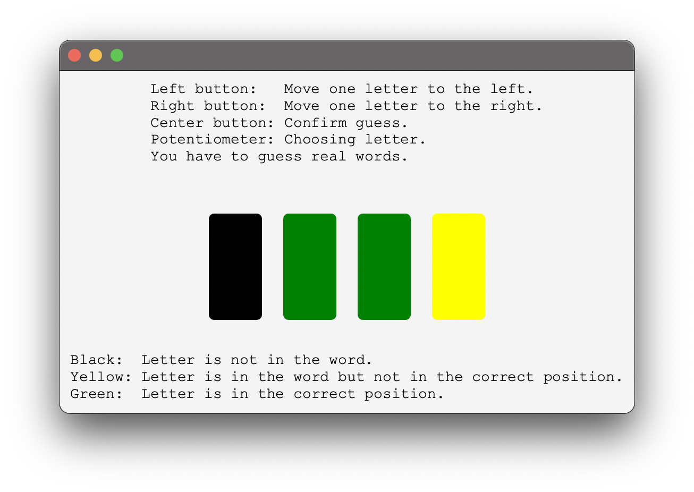
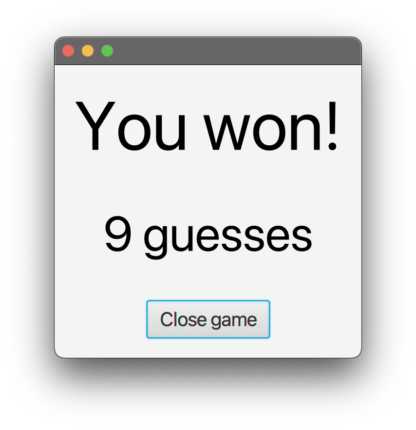

# ArdunioWordle

## C

### Main

```c
while (wordIndex <= WORD_LENGTH - 1)
{
    for (int i = 0; i < NUMBER_OF_LEDS; i++)
    {
        lightToggleOneLed(i);
        _delay_ms(100);
    }
}
```

To start off, I couldn't figure out how to send text from Java to C and save it in a variable. No matter what I tried, I couldn't get it to work. Because I'm using Java to store a long list of words (around 300), which I wouldn't be able to store on the Arduino, I wanted to send the secret word to the Arduino through the serial port. But since that wasn't working, I opted to use the incoming bytes as a way to control the flow of the program.  
As long as I haven't received any bytes from the java program, I show the LEDs flashing on and off in sequence.

```c
while (wordIndex < WORD_LENGTH + 6)
{
    for (int i = 0; i < NUMBER_OF_SEGMENT_DISPLAYS; i++)
    {
        if (i != selected)
        {
            if (chosenWord[i] < 0)
            {
                writeSymbolToSegment(i, UNDERSCORE);
            }
            else
            {
                writeLetterToSegment(i, (char)(chosenWord[i]));
            }
        }
        else
        {
            writeLetterToSegment(selected, (char)currentASCII);
            writeSymbolToSegment(i, DOT);
        }
    }
    ADCSRA |= _BV(ADSC);
}
```

The next part of the main function shows the chosenWord aka the current guess which is initalized as `int chosenWord[] = {-1, -1, -1, -1};`. If there is still a -1 in the current position of i, I show an underscore. Otherwise I show the letter of the chosenWord in that position. At the end of the loop I trigger the ADC interrupt.

```c
printf("%d", guessCounter);

playTone(30, 100);
_delay_ms(100);
playTone(30, 100);
_delay_ms(100);
playTone(30, 100);
_delay_ms(100);
playTone(50, 100);
_delay_ms(500);
playTone(30, 100);
_delay_ms(100);
playTone(50, 1000);
```

Finally, I send the amound of guesses to Java and play a little winning tune.

### Interrupts

```c
ISR(ADC_vect)
{
	int16_t value = ADC;
	if ((value - previousADCValue) > POTENTIO_DEBOUNCE)
	{
		currentASCII = (currentASCII + 1 - 65) % ALPHABET_SIZE + 65;
		previousADCValue = value;
	}
	else if ((value - previousADCValue) < -POTENTIO_DEBOUNCE)
	{
		currentASCII = (currentASCII + ALPHABET_SIZE - 1 - 65) % ALPHABET_SIZE + 65;
		previousADCValue = value;
	}
}
```

I implemented debouncing for the potentiometer using its interrupt service routine. Basically, I'm just checking if the current ADC value - the previous one is bigger the the debounce value or lower than the negative debounce value. If thats the case, I increment or decrement the current letter, making sure not to go out of bounds and update the previous ADC value to the current one.

```c
ISR(PCINT1_vect)
{
	uint8_t button = whichButtonPushed();
	switch (button)
	{
	case BUTTON1:
		chosenWord[selected] = currentASCII;
		selected = (selected + WORD_LENGTH - 1) % WORD_LENGTH;
		if (chosenWord[selected] == -1)
		{
			currentASCII = 65;
		}
		else
		{
			currentASCII = chosenWord[selected];
		}
		break;

	case BUTTON2:
		chosenWord[selected] = currentASCII;
		guessCounter++;
		confirm();
		break;

	case BUTTON3:
		chosenWord[selected] = currentASCII;
		selected = (selected + 1) % WORD_LENGTH;
		if (chosenWord[selected] == -1)
		{
			currentASCII = 65;
		}
		else
		{
			currentASCII = chosenWord[selected];
		}
		break;

	default:
		break;
	}
}
```

In the ISR for buttons, I check which button was pressed and then enter a switch depending on that button. If the first one was pressed, I move one position left on the display, if the right one was pushed, I move one to the right. Always making sure I update the letters of the chosenWord before moving and not moving out of bounds. If i would move out of bounds, I instead wrap around. If the center button is pushed, I first save the letter in the chosenWord, then increase the guessCounter and then confirm that word.

```c
ISR(USART_RX_vect)
{
	uint8_t byte = UDR0;
	wordIndex++;
}
```

This is the ISR for receiving data through the serial monitor. As I couldn't figure out how to save a string, I'm just counting the bytes that are coming in.

### Helper functions

```c
void convertAsciiToChar(char *string)
{
	for (int i = 0; i < WORD_LENGTH; i++)
	{
		string[i] = (char)chosenWord[i];
	}
}

void confirm()
{
	char *string = calloc(WORD_LENGTH + 1, sizeof(char));
	convertAsciiToChar(string);
	printf("%s", string);
	return;
}
```

With these two functions, I first create a string and allocate enough space for 5 characters. Then I convert the chosenWord int array to a string. Finally, I send that string to the Java program.

## Java

### Model

My model class, the SerialArduinoConnection holds all the wordChoices as well as the secret word, the current guess, the amount of guesses and the SerialPort.

```java
public SerialArduinoConnection() {
    arduinoPort = (SerialPort) Arrays.stream(SerialPort.getCommPorts())
                                        .filter(serialPort -> serialPort.toString().contains("USB") && serialPort.toString().contains("(Dial-In)"))
                                        .toArray()[0];
    boolean result = arduinoPort.openPort();
    System.out.printf("Port %s%s opened!\n", arduinoPort, result ? "" : " NOT");
    secret = getRandomWord();
    guess = "";
}
```

In the constructor, I look for a serialport that includes "USB" and "(Dial-In)" in its name. Then I open that port, set the secret word with a random one of my wordChoices and set the current guess to an empty string.

```java
public void sendString(String data) {
    PrintWriter writer = new PrintWriter(arduinoPort.getOutputStream());
    writer.print(data);
    writer.close();
}

public byte[] receiveBytes() {
    byte[] newData = new byte[arduinoPort.bytesAvailable()];
    arduinoPort.readBytes(newData, newData.length);
    return newData;
}
```

These two methods are responsible for sending and receiving bytes to and from the Arduino.

### View

The first part waits for a click on the start button, sends the secret word to the arduino once its pushed and moves to the next stage.  
In the next stage I show for each letter if it's in the correct position, or not in the word at all.



Once the correct word has been found, I send another word to the Arduino (to break out of the loop that displays the word) and then show the amount of guesses that I receive from the Arduino.


