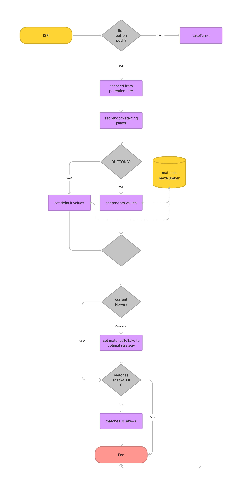

# Nim Project

## Quick overview

```c
int main(int argc, char const *argv[])
{
	setup();

	while (matches > 0)
	{
		displayScreen();
	}

	cli();

	if (isPlayerCurrentPlayer())
	{
		writeLongWord("congratulations you won   ", 24);
	}
	else
	{
		writeLongWord("you suck try again", 19);
	}
	return 0;
}
```

On a very high level there are only three steps to the game.

-   I set up everything needed for the game in the setup method.
-   After that, as long as there are still matches left, I display the screen.
-   At the end, I turn off the global interrupts system and display the end message depending if the user won or not.

## Preparations to play

```c
void setup()
{
	initUSART();
	enableAllButtons();
	getButtonsReadyForInterrupts();
	enableAllLeds();
	initADC();
	while (!btnPushed)
	{
		for (int j = 0; j < 4; j++)
		{
			lightToggleOneLed(j);
			_delay_ms(100);
		}
	}
	lightDownAllLeds();
	initDisplay();
	writeNumberAndWait(seed, 2000);
}
```

Here I enable all neccessary systems, buttons, LEDs, etc. As long as no button is pushed, I display a quick sequence. After that light down the LEDs, initialize the display and display the seed, that was set when I pushed the button to the user.

```c
ISR(PCINT1_vect)
{
	button = whichButtonPushed();
	if (!firstButtonPush)
	{
		doAction();
	}
	else
	{
		firstButtonPush = false;
		seed = getPotentiometerValue();
		srand(seed);
		currentPlayer += rand() % 2; // * starting player gets chosen randomly by default
		if (button == BUTTON3)		 // * BUTTON3 activates random mode
		{
			matches = rand() % 79 + 21; // * 21 - 99
			maxNumber = rand() % 7 + 3; // *  3 -  9
		}
		else
		{
			matches = START_NUMBER;
			maxNumber = MAX_NUMBER;
		}
		if (!isPlayerCurrentPlayer())
		{
			matchesToTake = (matches - 1) % (maxNumber + 1);
		}
		matchesToTake = matchesToTake ? matchesToTake : rand() % maxNumber + 1;
	}
}
```

To see what happens in the `ISR`, please refer to the following flow diagram.



## Taking an action

```c
void doAction()
{
	switch (button)
	{
	case BUTTON1:
		if (isPlayerCurrentPlayer())
		{
			matchesToTake = --matchesToTake ? matchesToTake : maxNumber;
		}
		break;
	case BUTTON2:
		swapPlayers();
		matches -= matchesToTake;
		if (!isPlayerCurrentPlayer())
		{
			matchesToTake = (matches - 1) % (maxNumber + 1);
			matchesToTake = matchesToTake ? matchesToTake : rand() % maxNumber + 1;
		}
		else
		{
			matchesToTake = 1;
		}
		break;
	case BUTTON3:
		if (isPlayerCurrentPlayer())
		{
			matchesToTake = matchesToTake % maxNumber + 1;
		}
		break;
	default:
		break;
	}
}
```

This method takes one of three actions depending on the button that was pressed. It executes every time a button is pressed, except the very first time.

-   BUTTON1: decrease the number of matches to take
-   BUTTON2:
    -   swaps active player
    -   reduce matches by matchesToTake
    -   set matchesToTake ready for next move
        -   computer: best possible strategy
        -   if that is not possible, set it to something random
        -   user: set to 1
-   BUTTON3: increase the number of matches to take

## Some helper functions

```c
uint8_t isPlayerCurrentPlayer()
{
	return *currentPlayer == players[0];
}
```

This returns true (1) or false (0) depending on if the user is the current player or not.

---

```c
void swapPlayers()
{
	currentPlayer++;
	if (!*currentPlayer)
	{
		currentPlayer -= 2;
	}
}
```

Increments the currentPlayer pointer, which points at a `char[]` and when it points to the `\0` char, it decrements the pointer by two.
